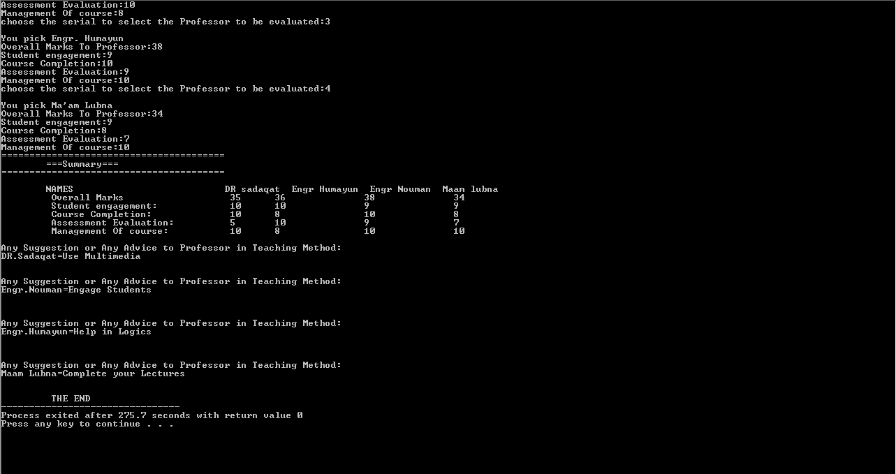

 Course Evaluation System

A C-based console application designed to collect and summarize performance evaluations for faculty members. This project was developed as an Open Ended Lab Practice for Computer Programming.

 Features
Professor Selection: Allows users to select specific faculty members for evaluation via a serial menu.
  Multi-Criteria Scoring: Evaluates performance based on five key metrics:
    1. Overall Marks
    2. Student Engagement
    3. Course Completion
    4. Assessment Evaluation
    5. Management of Course
  Data Visualization: Displays a formatted summary table of all marks at the end of the session.
  Feedback System: Collects specific suggestions or advice for each professor using string buffers.

 Technical Details
Language: C
Data Structures: Utilizes 2D integer arrays for score storage and 2D character arrays (strings) for feedback.
Control Flow:** Implements `for` loops for data entry and `if-else` logic for selection handling.

 Project Structure
 `main.c`: The primary source code containing the logic for the evaluation system.
 `README.md`: Documentation for the project.

 How to Run
1. Ensure you have a C compiler installed (like GCC or TDM-GCC).
2. Download the `main.c` file.
3. Open your terminal or command prompt.
4. Compile the code:
   bash
   gcc main.c -o CourseEvaluation
## Application Preview

### Summary Table - Part 1

### Summary Table - Part 2

